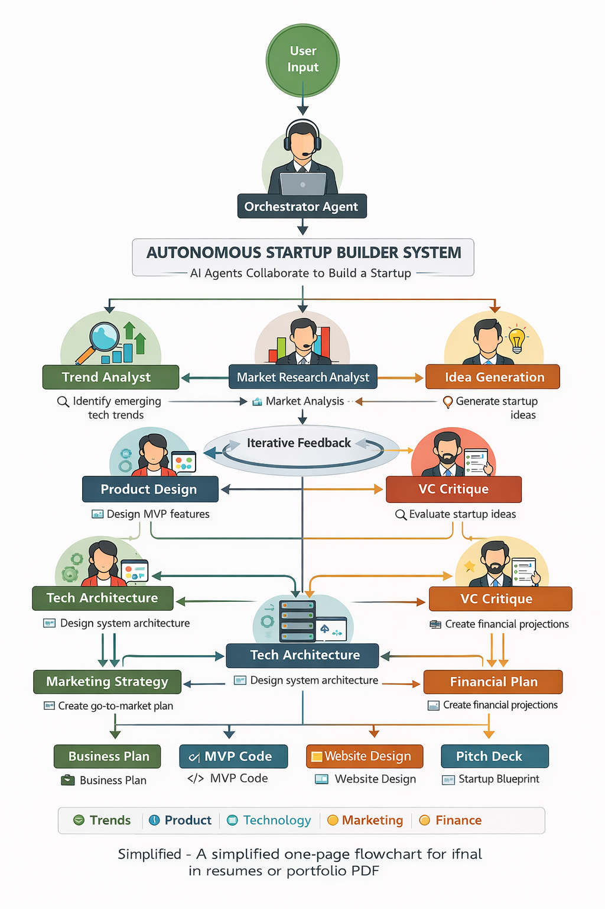

# Autonomous-Startup-Studio-AI

Autonomous Startup Studio AI Multi-Agent System that researches trends, generates startup ideas, designs products, builds architecture, and creates a full startup blueprint.

<!--  -->


## Environment setup

``` bash
pip install uv
uv tool install crewai
uv tool list
# crewai install
crewai create crew <your_project_name>
cd autonomous-startup-studio
pwd
```
